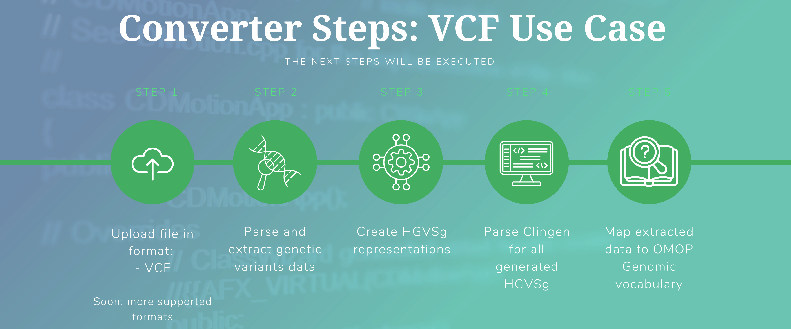
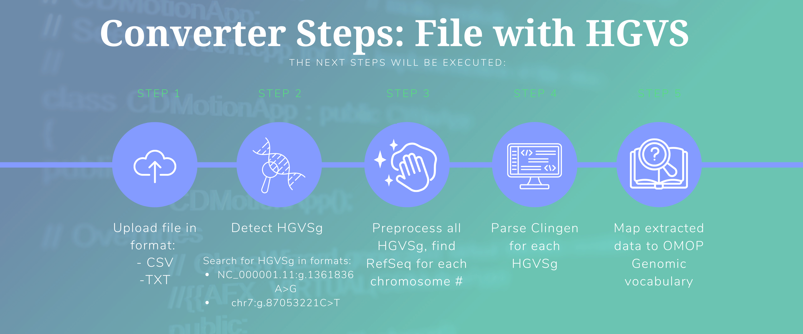

<h1> Koios: Odysseus Genomic Mapper 1.0

<h2> Website: https://koios.ohdsi.org
	
 
 

<h3> Technical support: </h3>

Nadia koios@ohdsi.org nadia.kadakova@odysseusinc.com

<h3> Overview </h3>

There is no comprehensive genomic terminology available in the public domain that would support harmonization of genomic oncology data, which is necessary for standardized analytics in a research network. 

To address these challenges and to develop interoperability between genomic data and clinical care, a collaboration between the OHDSI Oncology Workgroup and the VICC consortium is seeking to develop a canonical representation of equivalent variants to serve as standard concepts in the OMOP Standardized Vocabularies. [1]

KOIOS is a tool developed by[ Odysseus Data Services Inc](https://odysseusinc.com/) that allows you to find matching and missing concepts in OMOP Genomic Vocabulary for most types of raw patient-level genomic data. The current tool functionality allows to extract relevant variant information from VCF files, or detect HGVS in any TXT/CSV file. In the next step, KOIOS finds corresponding HGVS references in[ ClinGen](https://clinicalgenome.org/) for each variant, and maps the results to OMOP Genomic vocabulary. Extracted HGVS references can be used as either synonyms for the existing OMOP Genomic concepts, or as new entities.

<h3>

Python Package Installation

</h3>

I. Download all files and folders as a .zip archive from:

    [https://github.com/OHDSI/Koios](https://github.com/OHDSI/Koios)

II. Move 'Koios.zip' archive to your desired directory and unzip it.

<h3>

Manual - Run KOIOS

</h3>

III. Put VCF files to /Koios/app/input/ directory.

	Supported input file formats:

	- .vcf

	- .vcf.gz

	- .txt file with HGVS

	- .csv file with HGVS

IV. Run run_package.py file (in terminal or command prompt)

Syntax:

1)    cd ../full_path_to_folder/../Koios/

2)     python3 run_package.py [-h ][--help ]

    f.e.   python3 run_package.py -h

       	python3 run_package.py --help

Options for running run_package.py:

 	Parameter   Default usage       	Description

 	------------------------------------------------------------

	--help  -h	False  	Display help message.

IV.I. Alternatively, run run_app.py file (in terminal or command prompt) to open the program as a local web application.

The web application has the same interface as koios.ohdsi.org, but runs locally on your computer.

1)    cd ../full_path_to_folder/../Koios/

2)    python3 run_app.py

3)    open http://127.0.0.1:5000 in your browser to access the web app.
    

<h3> 

DEFAULT CONVERTER STEPS: VCF USE CASE

</h3> 

After you start running the converter in default mode, the next steps will be executed:

<h3> 

Step 1: VCF Processing

</h3> 

	1.1) Parse a VCF file and extract variants data. A VCF file contains the variants of a single patient.

	1.2) Create HGVSg representations.

Format:

    Reference : Description

Steps:

    - Extract Build and Chromosome Number (tag CHROM in the VCF file). Map this information to Global Assembly Definitions [1] provided by Genome Reference Consortium to find Reference Sequence Accession Number.

    Example: 'NC_000001.11' for Chromosome 1 and Build 38

    

    - Extract position (tag POS in the VCF file)

    Example: 114713909

 

    - Extract the reference genotype (tag REF in the VCF file)

    - Extract the alleles that differ from the reference read (tag ALT in the VCF file). Transformation is coded as: REF>ALT, f.e. G>T

    Result: NC_000001.11:g.114713909G>T
<h3> 

Step 2: Clingen Parser
</h3> 

	2.1) Generate ClinGen links based on HGVSg formed in the previous step.

    Example link: [2]

	2.2) Parse all available HGVS references matching the HGVSg representations.

	File format:

	VCF_file_name_clingen.csv

Columns:

    HGVSg_vcf:    				 HGVSg formed at step 1.2)

    link:    				 linked to ClinGen API formed at step 2.1)

    communityStandardTitle:     		 Clingen communityStandardTitle tag

    allele_class:    			 r.n. only data about genomicAlleles is extracted

    type:    				 Clingen type tag

    chromosome:    			 	 Clingen chromosome tag. Chromosome number of each allele

    allele_n:    				 Number of allele

    hgvs:    				 Clingen hgvs tag. HGVS reference

    hgvs_n:    				 Number of HGVS reference

    hgvs_referenceGenome:    	 	 Clingen referenceGenome tag

    referenceSequence:    		 	 Clingen referenceSequence tag

    hgvs_referenceSequence:     		 Clingen referenceSequence tag

<h3> 

Step 3: OMOP Mapping

</h3> 
	3.1) Map extracted hgvs to OMOP Genomic vocabulary, table CONCEPT SYNONYMS, field concept_synonym_name. Display matches

	3.2) Save matching hgvs as a .csv file. Output file location:

		- /omopvsf/output

<h3> 

DEFAULT CONVERTER STEPS: File with HGVS

</h3> 

Next steps are executed in the HGVS mode.

<h3> 

Step 1: HGVS Processing

</h3> 

For this mode, you need to already have a file that contains a column with HGVS in one of these formats:

	- NC_000001.11:g.1361836A>G

	- chr7:g.87053221C>T

Currently, KOIOS supports two formats of such input files: .txt and .csv. First, KOIOS will detect a column where most of the values are HGVS in one of formats displayed above. Then, it will preprocess HGVS and bring them to standard format - HGVS nomenclature standard [3]. The next steps will be similar to steps 2, 3 of the VCF mode.

___

           	Thank you for using this converter.

OHDSI
 
Odysseus Data Services

---

Links

[1] https://www.ncbi.nlm.nih.gov/assembly/GCF_000001405.26/

[2] https://reg.genome.network/allele?hgvs=NC_000001.11:g.114713909G>T

[3] https://varnomen.hgvs.org/bg-material/simple/

---
